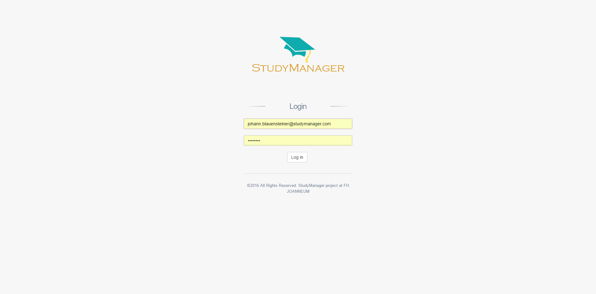
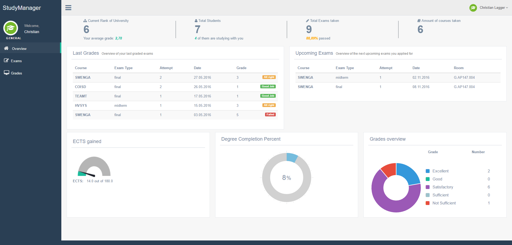
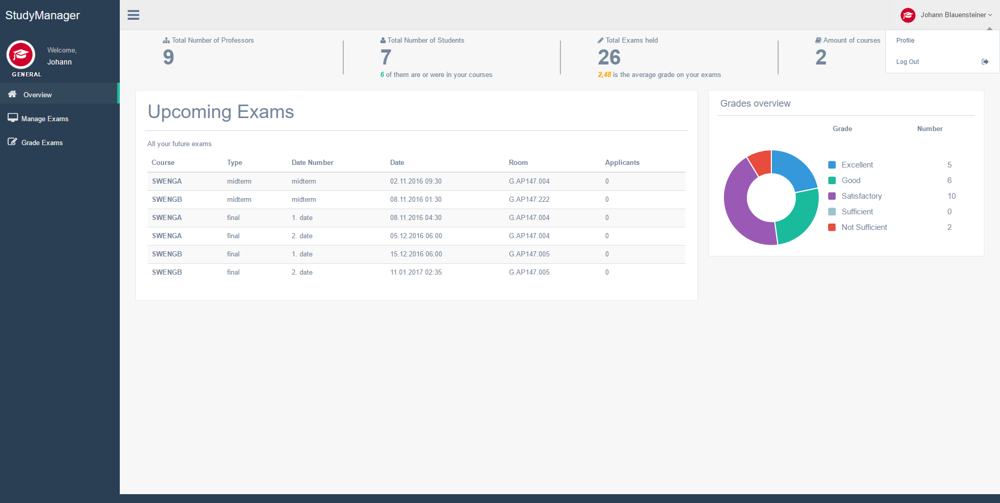

# 
University Grading System in Form of a Web Application that allows teachers to create new exams and grade their students, while the students are able to enrol for these exams and check their grades. Furthermore, it provides both teachers and students with statistics in order to analyze the outcomes of their exams.

Developed with Java and Spring

## Login screen

## Student Dashboard

## Teacher Dashboard

## Team Members
- Amar Bajric
- Christian Lagger
- Georg Meizenitsch

